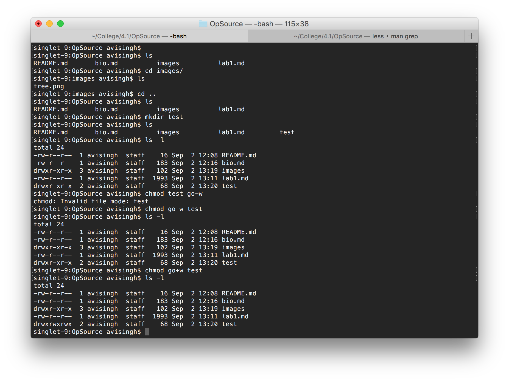
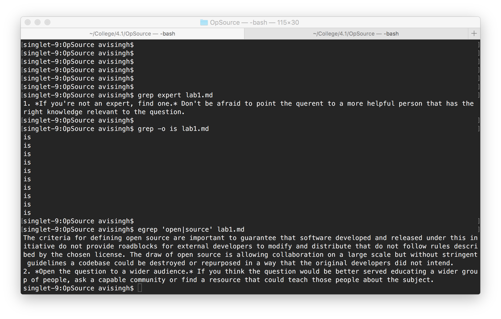
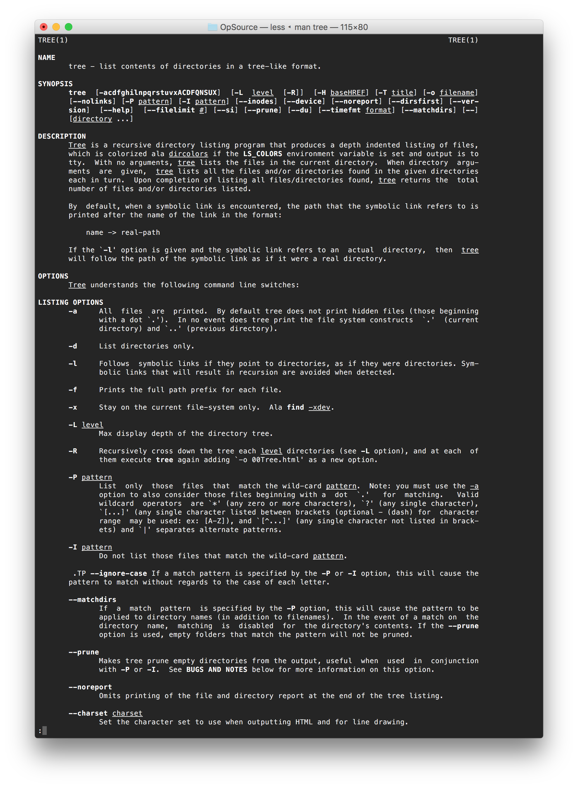
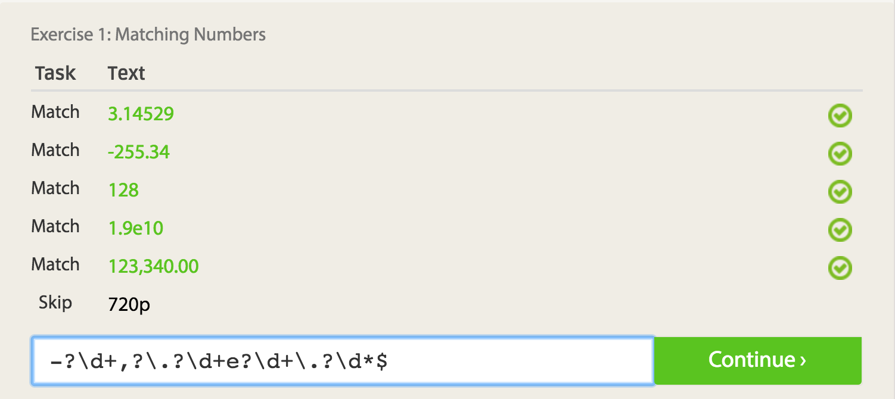
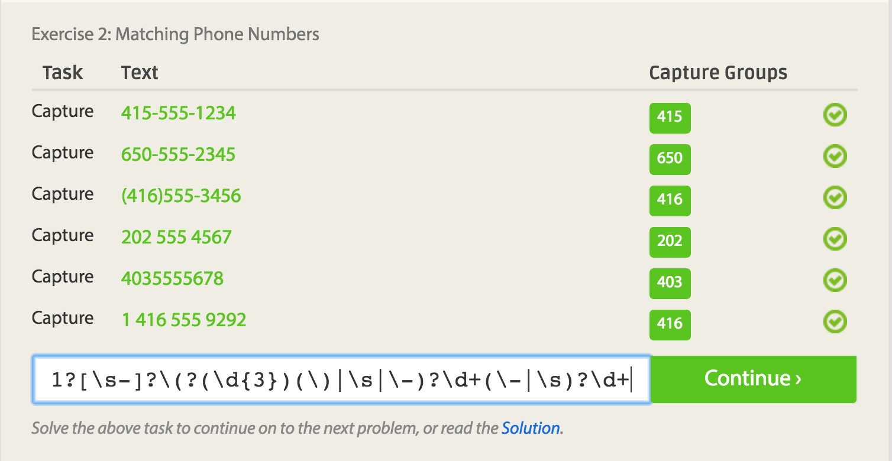
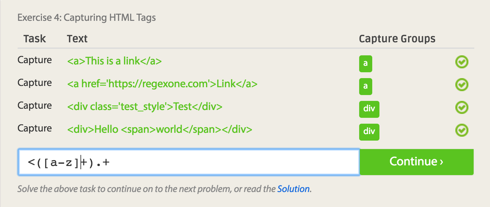
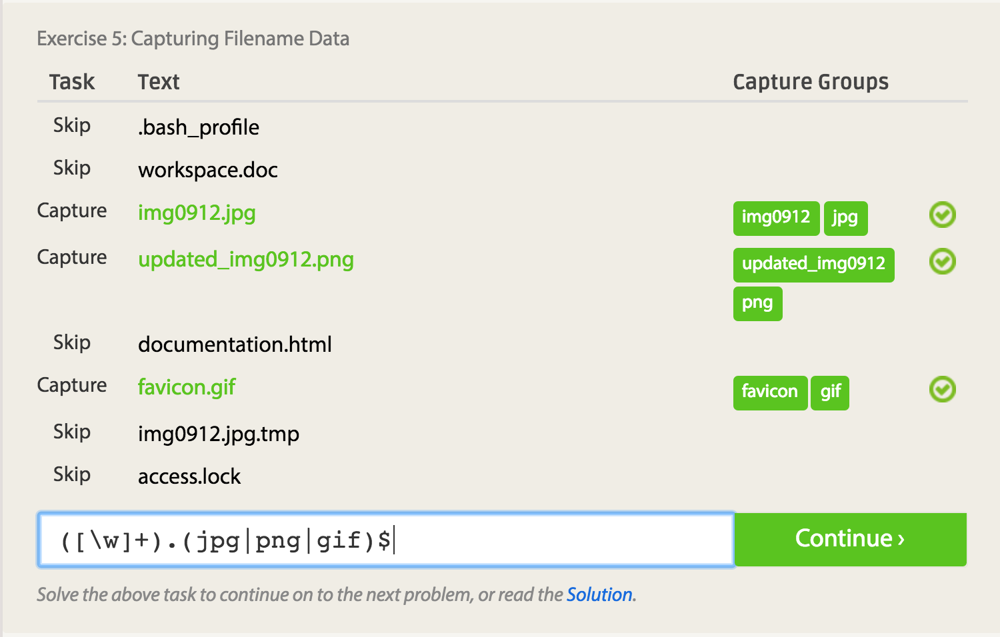
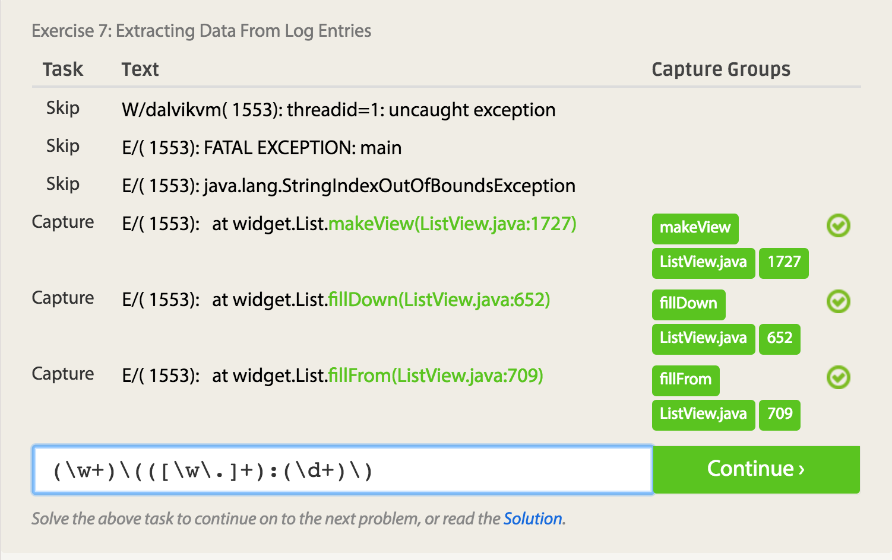
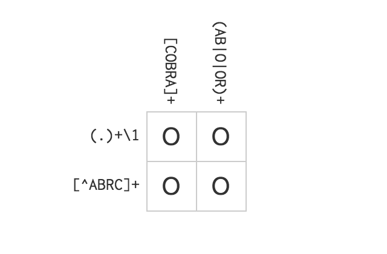

### Reading Assignments
#### Reflecting on The Open Source Definition
The criteria for defining open source are important to guarantee that software developed and released under this initiative do not provide roadblocks for external developers to modify and distribute that do not follow rules described by the chosen license. The draw of open source is allowing collaboration on a large scale but without stringent guidelines a codebase could be destroyed or repurposed in a way that the original developers did not intend.

#### Suggestions for How to Answer Questions in a Helpful Way
1. *If you're not an expert, find one.* Don't be afraid to point the querent to a more helpful person that has the right knowledge relevant to the question.
2. *Open the question to a wider audience.* If you think the question would be better served educating a wider group of people, ask a capable community or find a resource that could teach those people about the subject.

#### Reflecting on Free Culture Chapter 3
Based on other readings about similar lawsuits in the technology sector, most prominently in Silicon Valley, the common theme is that a behemoth company that dominates an industry has supreme power to destroy young entrepreneurial individuals with money, pervasive lobbying and overpaid lawyers that use fear tactics to force settlements. Lawsuits like these have little financial impact on the company but deals a major blow to the innovators not only in the realm of money but to the creative spirit. Any powerful force that stifles innovation is a threat to young minds who have great ideas but fear the repurcussions of entering an industry with confusing regulations that can only be understood with the assistance of a lawyer, which tends to require money that college students or recent graduates tend to lack. It is a cheap move that a company, for example the RIAA, is supporting the artists when indeed it is benefiting the men or women holding the highest positions.

### Linux Commands
#### Basic Commands

#### Grep Commands

#### Installing Tree

### Regex
#### Practice Problems

#### Crossword

#### Blockly Puzzle

### Reflections on an interesting problem
One issue I have come across during my time at RPI is the inefficient system for calling for a ride to get to
a fraternity during social events. If a house is far from campus, the fraternity will have designated drivers
to bring students to and from their house; however, only one call can be handled at a time via cellphone or if by text message the messages have to be read and responded to by the driver when idling or a passenger with the responsibility. A solution I have considered is designing a mobile appilcation to request and serve rides in much the same way Uber operates. A fraternity can have an administrative account to handle drivers and keep track of their location and the driver will be able to see rider requests nearby and choose to fulfill them. This application has potential for adoption at every major university with a fraternity presence that has some designated driver system for social events held at their chapter house.