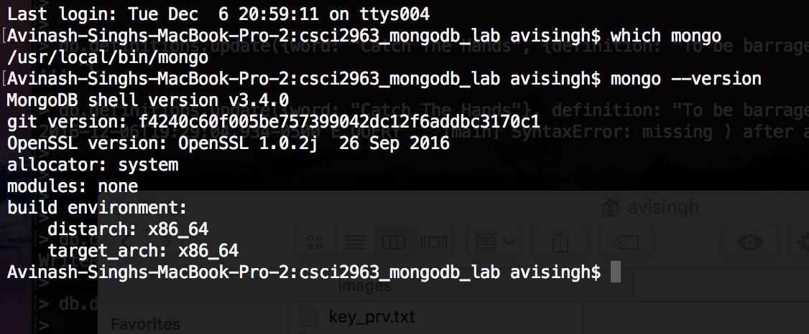
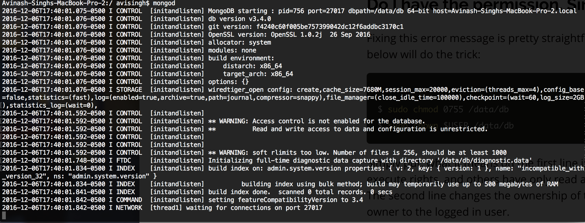
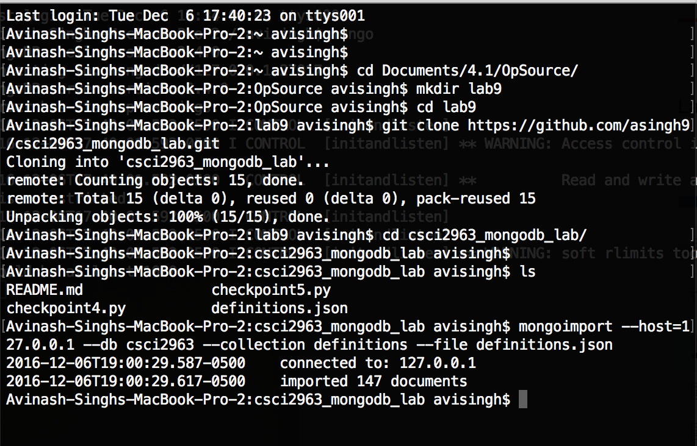
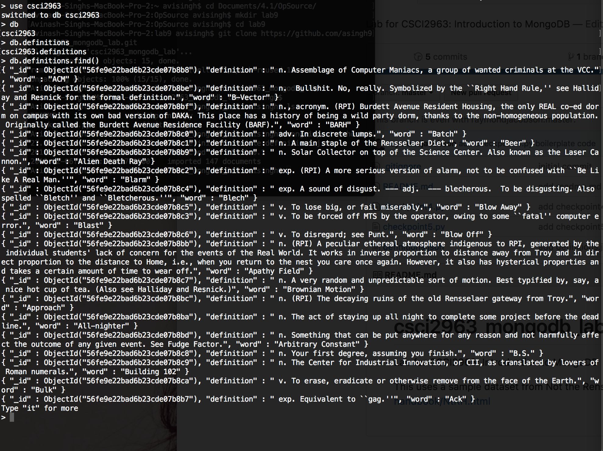
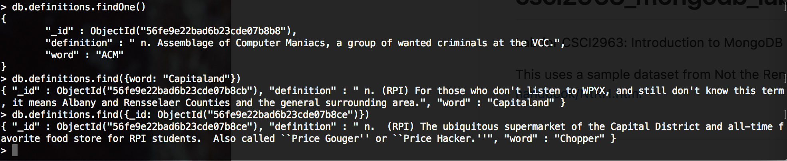
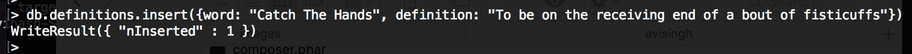
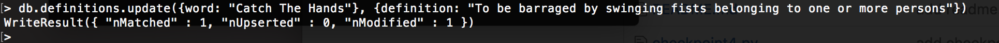
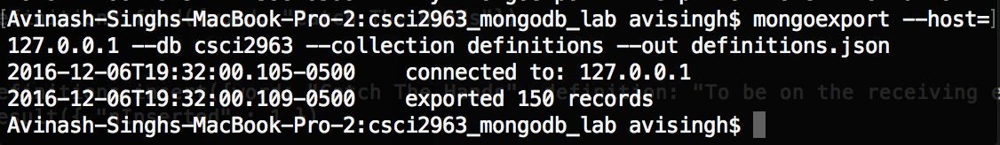

## Checkpoint 1: Install MongoDB

## Checkpoint 2: Load Some Data

## Checkpoint 3: Basic Queries

## Checkpoint 4: Driving Queries
File checkpoint.py and output file checkpoint.txt located in directory (lab10njmj)
