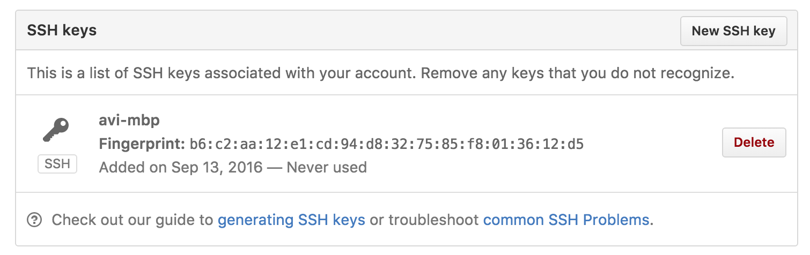
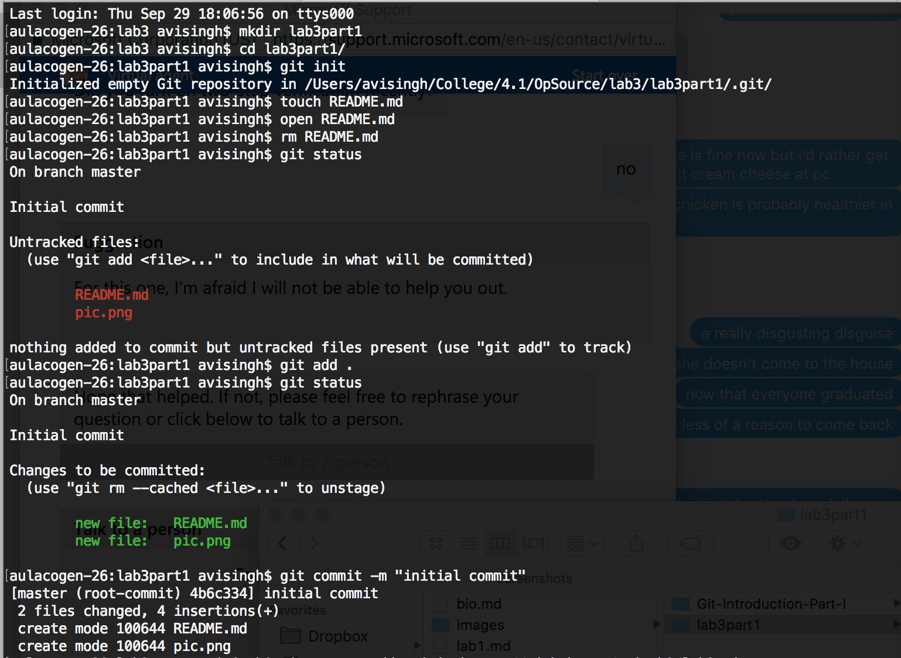
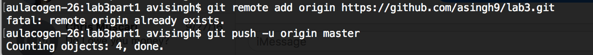
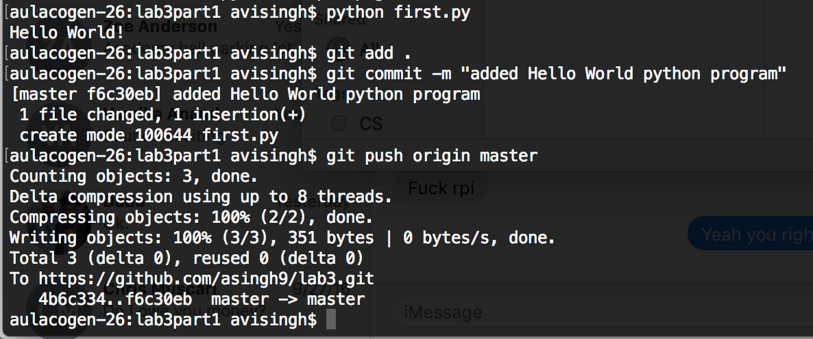
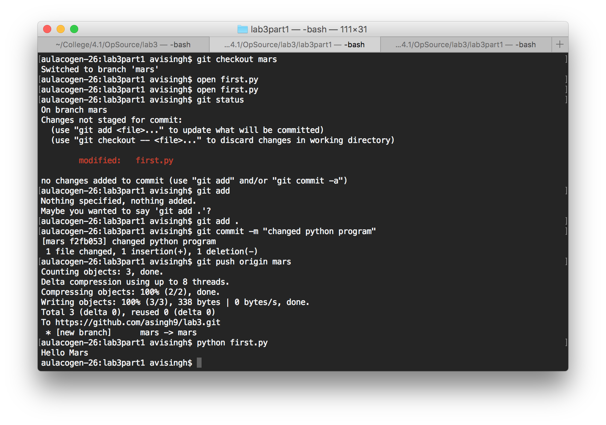
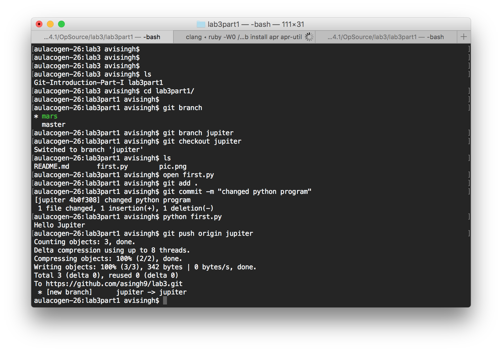
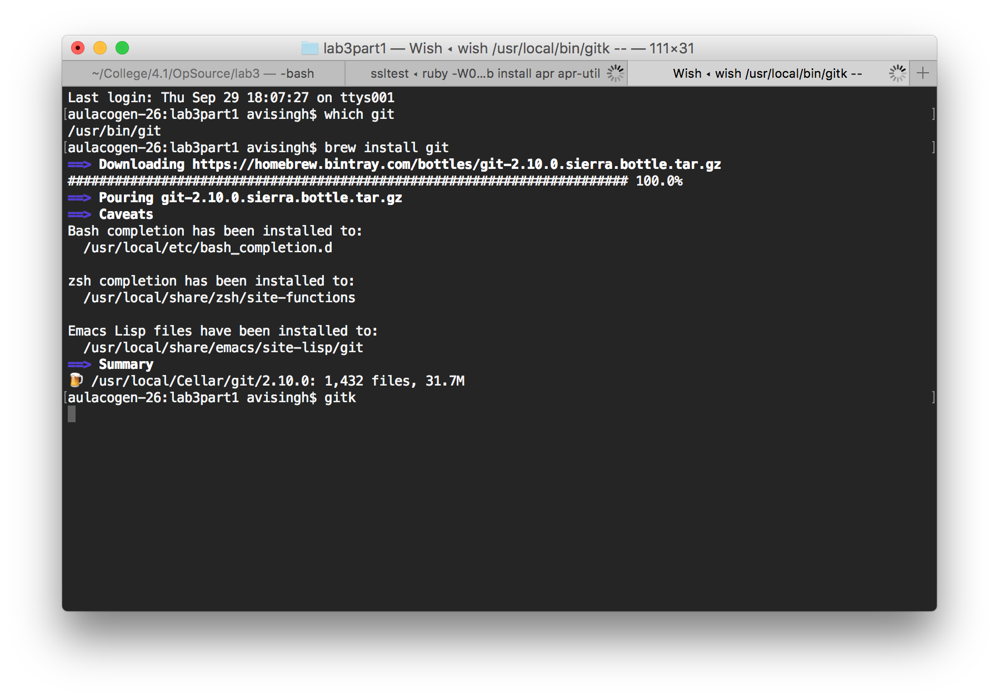
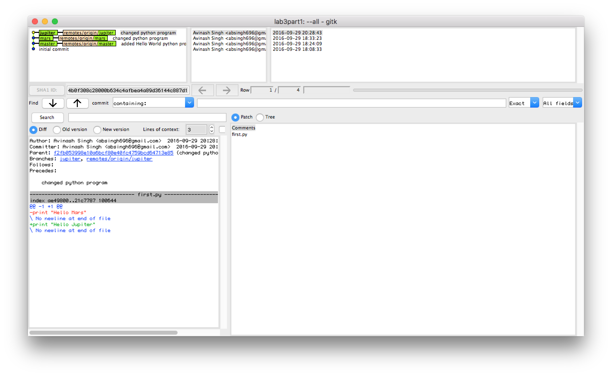
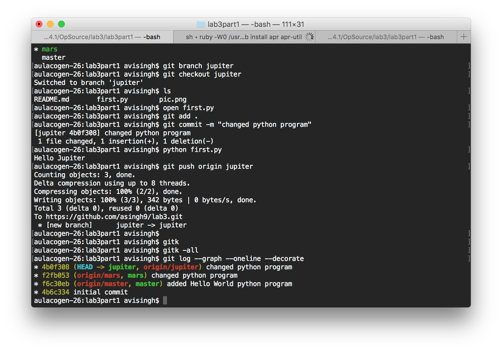
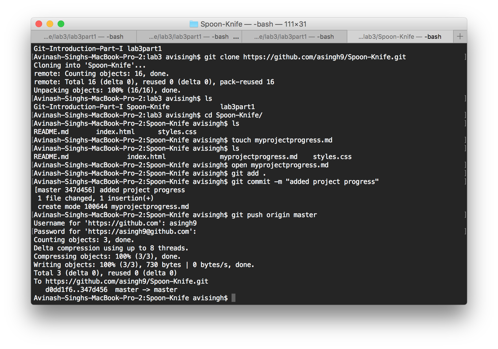

## SSH key

## Part 1
### Setting up Git
#### Creating a README

### Creating Repository

#### Pushing to master

#### Link to Repo
[lab3 repository](https://github.com/asingh9/lab3)
### Python program - Hello World

#### Branch - Mars

#### Branch - Jupiter

#### gitk installation

##### gitk program

##### gitk --all

##### git log

## Part 2
### Forking Spoon-Knife

### Git terminal commands

### Learning Branching
