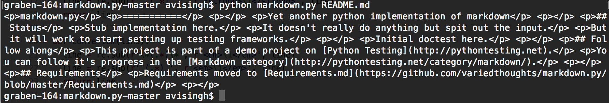
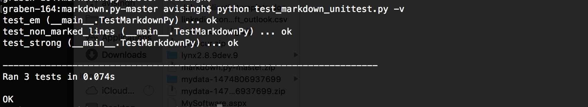

### Part 1 - Community Testing
#### Project Selection
##### ii. Retrieved Repository Statistics
|-------------------| # contributors | # lines of code | First commit | Latest commit | Current branches |
|-------------------|----------------|-----------------|--------------|---------------|------------------|
| FullScreenPokemon | 8				 | 54883		   | Nov 29, 2014 |	Nov 28, 2016  |	12				 |
| geocommerce		| 1				 | 52560		   | Oct 24, 2016 |	Nov 29, 2016  | 1				 |
| GLS				| 4				 | 15465		   | Mar 18, 2016 |	Nov 10, 2016  | 5	 			 |
| Grove				| 4				 | 10044		   | Aug 16, 2015 |	Nov 23, 2016  |	10				 |
| HeavyLook			| 1				 | 2			   | Oct 21, 2016 | Oct 21, 2016  | 1				 |

#### Gitstats
##### ii. Gitstats Repository Statistics
|-------------------| # contributors | # lines of code | First commit | Latest commit | Current branches |
|-------------------|----------------|-----------------|--------------|---------------|------------------|
| FullScreenPokemon | 10			 | 57271		   | Nov 29, 2014 |	Nov 28, 2016  |	?				 |
| geocommerce		| 2				 | 75800		   | Oct 24, 2016 |	Nov 29, 2016  | ?				 |
| GLS				| 5				 | 19518		   | Mar 18, 2016 |	Nov 10, 2016  | ?				 |
| Grove				| 7				 | 16337		   | Aug 26, 2015 |	Nov 23, 2016  |	?				 |
| HeavyLook			| 1				 | 2			   | Oct 21, 2016 | Oct 21, 2016  | ?				 |

##### iii. Comparing Results
For the manually retrieved statistics I used a tool found on github called cloc (https://github.com/AlDanial/cloc), which counts lines of code in a variety of languages and outputs a table with the sum total. The totals differed from Gitstats most likely because each count lines of code differently. For cloc, I totaled lines of code and comments and left out blanks, which accounts for some of the discrepancy between the two.

#### Streaming Contribution Visualizations
[fullscreenpokemon](https://youtu.be/UzCB_BD6WoE)
Top Contributor: Josh Goldberg

[geocommerce](https://youtu.be/OlJDJJk29do)
Top Contributor: Ranjit Marathay

[gls](https://youtu.be/IcD-wi-aWV8)
Top Contributor: Josh Goldberg

[grove](https://youtu.be/mu00DwO8CPI)
Top Contributor: Max Shavrick

[heavylook](https://youtu.be/s1O8KOMRLsU)
Top Contributor: Ron Lee

### Part 2 - Unit Testing
#### Running markdown.py

