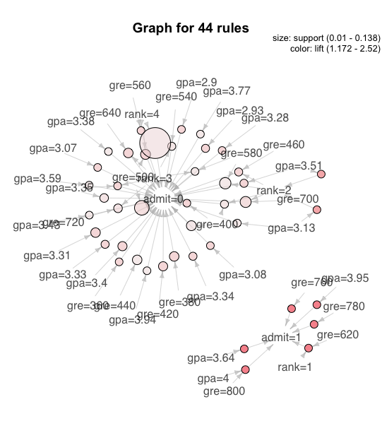

1. Association Rule Mining reading material

2. *arules and arulesViz installation*

3. *Association rules for Graduate Admissions Data set*
R script located in directory (lab8-graduate-assc-rules.R)

4. Visualizations of rules

6. I have switched project from a sober driver ride-hailing application to an application that can take large PDF's such as legal documents, press releases, earning statements and attempt to give a summmary of important items depending on the document or provided keywords. Currently I anticipate implementing this program in Python and perhaps use integrate R for statistical analysis.